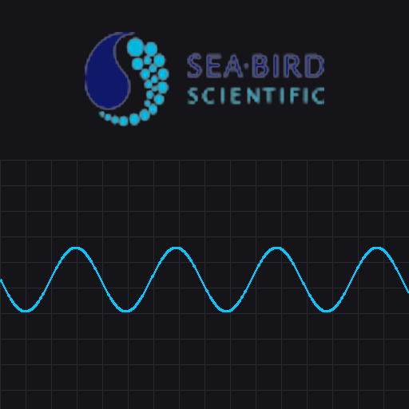

<p align="center">

</p>

# Engineer’s Field Kit – Multitool

[](https://github.com/SBS-jklumpp/Engineer-Field-Kit/actions/workflows/ci.yml)
[](https://github.com/SBS-jklumpp/Engineer-Field-Kit/blob/main/LICENSE.txt)

A modern, engineer-first multitool for testing, debugging, verifying, and analyzing scientific instrumentation (with a focus on Sea-Bird workflows).

**What it is**
- A single desktop app that brings together day-to-day engineering “bench work” utilities in one place.
- Built for fast iteration: plot, inspect, sanity-check signals, log streams, and run quick analysis loops while you troubleshoot.

**What it is not**
- Not a replacement for formal calibration/QA systems.
- Not an autopilot: the tool helps you *see and decide* faster.

## Highlights
- Serial console + structured logging
- Real-time plotting / quick-look graphs
- Noise / stability checks (where applicable)
- Utilities for debugging, verification, and test workflows
- Dark, modern UI theme

## Quick start (dev)
```bash
python -m venv .venv
# Windows:
.venv\Scripts\activate
# macOS/Linux:
# source .venv/bin/activate

pip install -r requirements.txt
python -m engineers_field_kit_multitool.app
```

## Configuration
The default configuration is stored at:
- `src/engineers_field_kit_multitool/config.json`

## Packaging (PyInstaller)
The PyInstaller spec is located at:
- `packaging/Engineers_Field_Kit_Multitool.spec`

To build (example):
```bash
pip install pyinstaller
pyinstaller packaging/Engineers_Field_Kit_Multitool.spec
```

## Repo layout
```text
Engineer-Field-Kit/
├─ src/engineers_field_kit_multitool/   # app package
├─ tests/                               # unit tests
├─ docs/                                # documentation
├─ assets/                              # icons, images
├─ packaging/                           # build specs
└─ .github/                             # CI + templates
```

## Contributing
Please read `CONTRIBUTING.md` before opening a PR.

## License
See `LICENSE.txt`.

---
**Status:** early-stage / actively evolving (2026-02-25)
